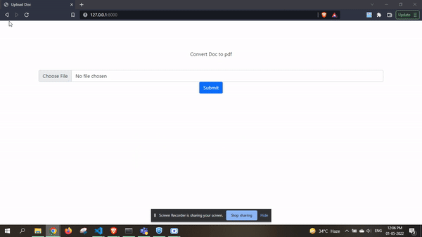
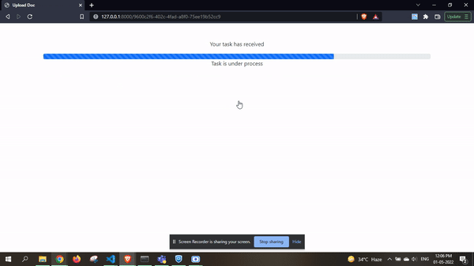
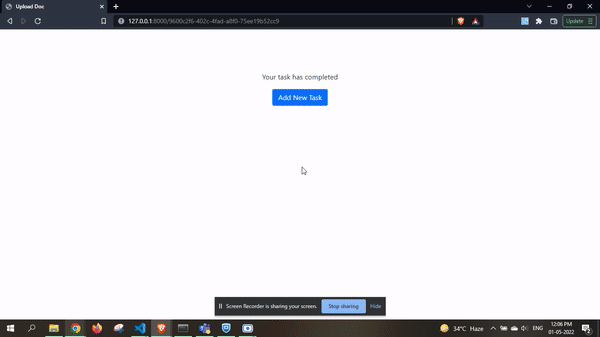

# Docs To PDF

This project was created in Django framwork which is base on python.With the help of this project you can convert ```Docs to PDF```.
this project was created with the help of celery Distributed task queue.

## Setup this Project & Run Locally

Clone the project/ Extract folder

```bash
  git clone https://github.com/charandass/doc_to_pdf_django.git
```
* Download ```Zip``` file and extract it.

Go to the project directory

```bash
  cd celery_exaple
```
* Create ```Virtual Envionment```
* Activate ```Virtual Envionment```
* install `Redis` in your machine

Install dependencies

```bash
  pip install -r requirements.txt
```

Start the server

```bash
  python manage.py runserver
```
Check the project on Browser using
```bash 
  http://127.0.0.1:8000/
```
Start Celery task quere in another terminal
```bash
  celery -A celery_example worker -l info -P eventlet
```


## Here are some practical Demo





